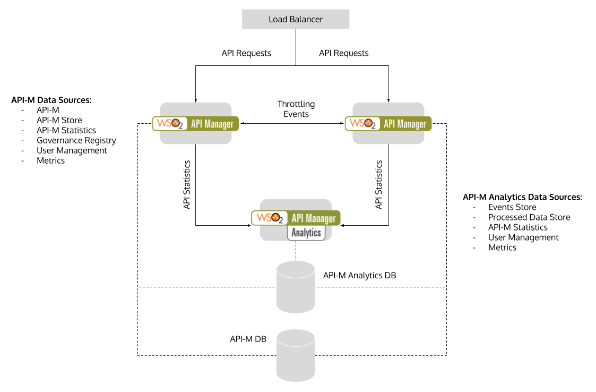

# WSO2 API Manager Deployment Guide

This repository contains configurations required for setting up WSO2 API Manager 2.1.0 and WSO2 API Manager Analytics 2.1.0 according to all-in-one deployment pattern on a local machine. The purpose of creating this repository is to provide a clear view of the deployment architecture, configurations required and the dependencies that exist between components.

## Deployment Architecture

The following diagram illustrates the deployment architecture:


## Repository Content

- #### /conf/default
  The default configurations folder contains all configuration files that ship with the WSO2 API Manager and WSO2 API Manager Analytics distributions.

- #### /conf/wso2am-2.1.0-1
  This folder contains configurations common for both WSO2 API Manager node 1 and node 2.

- #### /conf/wso2am-2.1.0-2
  This folder contains configurations specific to WSO2 API Manager node 2.

- #### /conf/wso2am-analytics-2.1.0
  This folder contains configurations required for WSO2 API Manager Analytics node.

- #### /dist/
  This folder has been reserved for copying the WSO2 API Manager distribution, API Manager Analytics distribution and MySQL connector for Java.

- #### /volumes/apim-gateway/synapse-configs/
  This is the default synapse configuration folder shipped with the API Manager 2.1.0 distribution. It has been copied to a separate folder to be able to mount to both API Manager nodes via symlinks.

## Quick Start

- Clone this repository:

  ````
  git clone https://github.com/imesh/wso2-apim-deployment-guide.git
  ````

- Download WSO2 API Manager 2.1.0 and WSO2 API Manager Analytics 2.1.0 distributions via [WSO2 Update Manager](http://wso2.com/api-management/#download) and copy them to the ```dist/``` folder.

- Download [MySQL connector for Java](https://dev.mysql.com/downloads/connector/j/) distribution, extract it and copy the JAR file to the ```dist/``` folder.

- Update MySQL connector JAR filename in setup.sh script:

  ````
  connector_jar="mysql-connector-java-5.1.36-bin.jar"
  ````

- Install JDK 8, set JAVA_HOME and update the $PATH variable:

  ````bash
  export JAVA_HOME=`/path/to/jdk/home/directory
  export PATH=$JAVA_HOME/bin:$PATH
  ````

- Execute ```setup.sh``` script to setup the deployment:

  ````bash
  ./setup.sh
  ````

- Once the work is completed, execute ```clean.sh``` script to remove the deployment. 
  Note that this operation will remove both MySQL database containers, WSO2 API Manager and
  WSO2 API Manager Analytics installations:

  ````bash
  ./clean.sh
  ````
